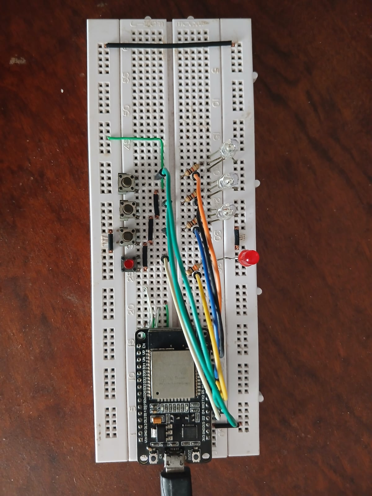
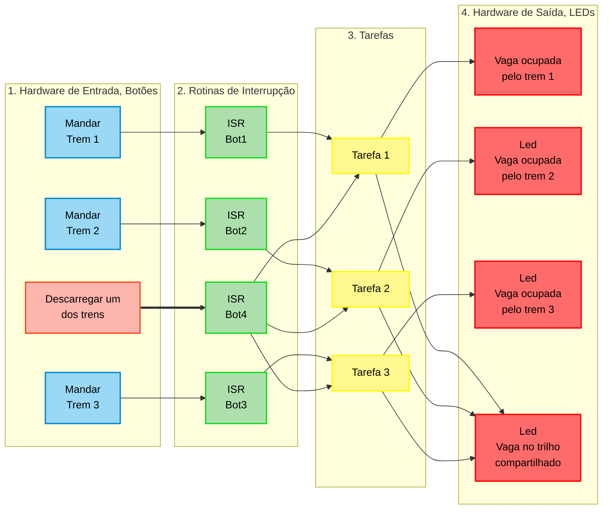

# **Projeto 2 de Sistemas em Tempo Real**

> **Disciplina**: Sistemas em Tempo Real

> **Alunos**:
> - Artênio José Teofilo Correia
> - Edileudo da Silva Guedes Filho
> - José Vanilson de Brito Júnior

## **Vídeo demonstrativo de funcionamento**

YouTube: <youtube.com>

## **Descrição**

> - **Linguagem usada**: C
> - **Microcontrolador utilizado**: Esp 32 Devkit 1

### **> Visão Geral**

O sistema foi implementado fisicamente usando o microprocessador Esp32, com 4 botões e 4 leds. É mostrado pela figura a seguir o circuito na protoboard.

Três botões representam o sistema mandando um trem da mina já carregado e um botão é usado para determinar o momento de descarregamento de um dos 3 trens de forma aleatorizada. Cada LED representa a vaga do trilho compartilhado e as três vagas do pátio de descarga.

#### **> Diagrama arquitetural das tarefas**

### **> Objetivos**

Retomar o projeto anterior, implementando-o em uma plataforma prática usando o FreeRTOS.

### **> Funcionamento do código**

O código utiliza o FreeRTOS para criar tarefas independentes que rodam de forma escalonada em um núcleo do processador do Esp32. Usando semáforos e mutexes, o sistema segue funcionando se auto gerenciando.